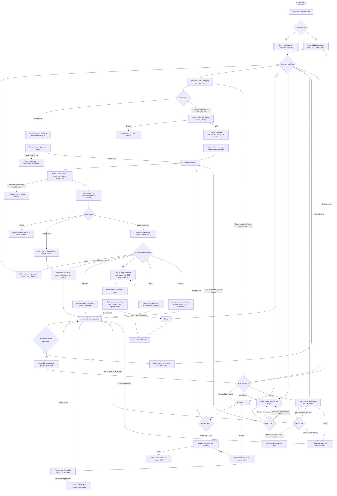

# Vestige Stock application flow

```mermaid
flowchart TD
    A([Open app]) --> B[Load local SQLite snapshot]
    B --> C{Snapshot valid?}
    C -- No --> C1[Show recovery error; preserve saved data]
    C -- Yes --> D[Home dashboard: sales, profit, stock, expiry alerts]
    D --> E{Choose a workflow}

    E --> H[Home: date range, price check, quick actions]
    E --> P[Products: search, category and stock filters]
    E --> R[Receive stock]
    E --> S[Billing]
    E --> T[Activity: sales, receipts and returns]
    E --> M[More: reports, settings and data recovery]

    P --> P1{Product action}
    P1 -- Search or filter --> P2[Match saved products and preloaded catalogue]
    P2 --> P3[Review matching product rows]
    P3 -- Export filtered CSV --> P4[Create inventory CSV; Android document saver]
    P3 -- Scan or edit --> SC[Start barcode scan]
    P1 -- Import zero-stock catalogue CSV --> P5[Validate every row against bundled catalogue]
    P5 -- Invalid --> P6[Show row errors; do not import]
    P5 -- Valid --> P7[Preview then add catalogue products at zero stock]
    P7 --> P8[Link each item to its real physical pack barcode]
    P8 --> SC

    R --> R1{Receive action}
    R1 -- Scan product --> SC
    R1 -- Import stock CSV --> R2[Validate entire file and preview]
    R2 -- Invalid --> R3[Show error; preserve receipt draft]
    R2 -- Valid --> R4[Add validated rows to receipt draft]
    R4 --> R6[Review quantity, batch, expiry, DP and MRP]
    R6 -- Confirm receipt --> V[Validate domain operation]
    R6 -- Mark opening balance --> R5[Exclude opening stock from purchase totals]
    R5 --> V
    R4 -- Cancel --> R

    S --> S1[Scan product barcode]
    S1 --> S2[Enter quantity; selected selling plan sets GST-inclusive price]
    S2 --> S3[Add quantity to saved bill draft]
    S3 --> S4[Review batches, selling plan, customer and payment record]
    S4 -- Complete bill --> V
    S4 -- Cancel or continue later --> S

    SC --> N[Android validates scan mode and camera permission]
    N -- Permission denied or invalid mode --> N0[Show error; no inventory change]
    N --> N1[ZXing camera or connected keyboard scanner]
    N1 --> N2{Scan result}
    N2 -- Cancel --> N3[No stock change; return to current workflow]
    N2 -- Catalogue QR --> N4[Match VSCAT reference to physical barcode]
    N4 --> N5[Prefill product details; review against pack and invoice]
    N2 -- Physical barcode --> N6[Resolve product and, where needed, batch]
    N6 --> N7{Requested scan mode}
    N7 -- Price --> H
    N7 -- Add, edit or link product --> N5
    N7 -- Receive --> RQ[Enter quantity; use saved DP, GST and MRP]
    RQ --> V
    N7 -- Bill --> S2
    N7 -- Return --> N8[Match original bill and available return quantity]
    N7 -- Write-off --> N9[Choose batch, quantity and reason; move units to quarantine]
    N8 --> V
    N9 --> V
    N5 --> V

    T --> T1{Activity action}
    T1 -- Review bill or receipt --> T
    T1 -- Re-export saved invoice PDF --> T
    T1 -- Scan return from original invoice --> SC

    M --> M1{More action}
    M1 -- Reports and expiry alerts --> M
    M1 -- Store details or selling plan --> V
    M1 -- Export complete JSON backup --> M2[Save backup file outside app]
    M1 -- Restore JSON backup --> M3[Validate and review selected backup]
    M3 -- Cancel --> M
    M3 -- Confirm replacement --> V

    V --> V1{Domain validation succeeds?}
    V1 -- No --> V2[Show explicit error; keep previous state]
    V2 --> E
    V1 -- Yes --> W[Atomically persist state with revision check]
    W --> W1{Saved operation}
    W1 -- Quick receipt, product or adjustment --> P
    W1 -- Reviewed CSV receipt --> R
    W1 -- Bill or return --> T
    W1 -- Settings --> M
    W1 -- Backup restore --> D
    W1 -- Read-only scan --> E
```
